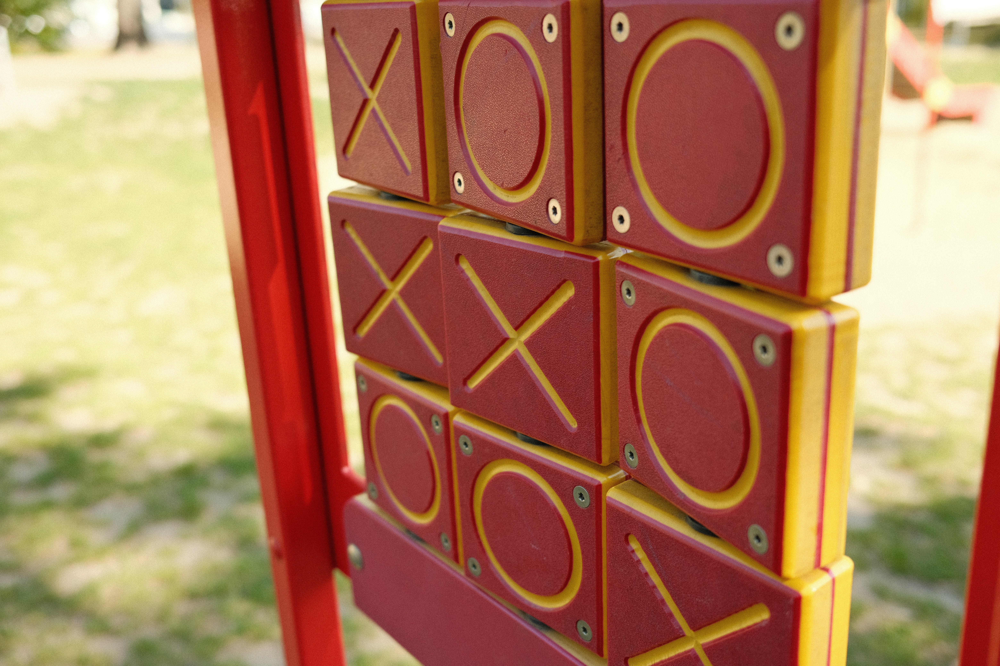

# tictactoe

MITxPro Tic-Tac-Toe game project.
### Details 
It makes use of React with parent and child inheretance to render Tic-Tac-Toe game.
#### Potential Improvements
There could be conditional logic that disables a button if a player has already made a choice at that id. (Updated: now included in the code).
#### How to Run
Install dependencies from the [repository](https://github.com/TaylorCharlesHall/tictactoe) into the same directory. Drag and drop index file into any browser. You can also run it by clicking [here](https://taylorcharleshall.github.io/tictactoe).

[Home](https://taylorcharleshall.github.io)
